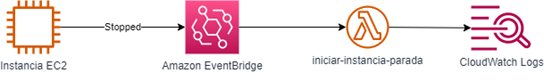

# **AWS Academy EC2 Auto Start**

## **Objetivo**

AWS Academy Learner Labs proporciona un <em>sandbox</em> para la creación de recursos en la nube de AWS. Para no malgastar los créditos que disponen los alumnos, el laboratorio detiene todas las instancias EC2 lanzadas. Sin embargo, en ocasiones puede ser interesante para un alumno mantener iniciada una instancia EC2 más allá de la vida del Learner Lab.

La solución propuesta permite etiquetar las instancias EC2 con el par clave-valor `inactividad : no` para que, una vez cerrada la sesión en AWS Learner Labs vuelva a lanzar las instancias EC2 etiquetadas en la región donde se despliegue la solución.

## **Requerimientos**

* Disponer de una cuenta en un curso de AWS Academy Learner Labs
* Configurar un entorno para AWS CLI con las credenciales del laboratorio

## **Arquitectura propuesta**

  

## **Servicios utilizados**

* **Amazon EventBridge** para definir una regla sobre un bus de eventos que se dispare cada vez que se detiene una instancia etiquetada con el par clave valor `inactividad : no` 
* **AWS Lambda** para implementar la lógica del inicio de la instancia etiquetada
* **Amazon CloudWatch Logs** para recolectar los registros de ejecución de la función Lambda

## **Instrucciones** (manual)

1. Comprimir el archivo con el código de la función Lambda, que se encargará de iniciar las instancias EC2 en formato ZIP:

        zip iniciar_instancia.zip iniciar_instancia.py

2. Obtener el ARN del LabRole:

        arn=arn:aws:iam::$(aws sts get-caller-identity --query Account --output text):role/LabRole

3. Seleccionar la región donde se desplegará la solución. Actualmente los AWS Academy Learner Labs sólo permiten las regiones `us-east-1` y `us-west-2`

        region=us-east-1

4. A continuación, se crea la función Lambda:

        arnlambda=$(aws lambda create-function --function-name iniciar-instancia-parada --role $arn --handler iniciar_instancia.handler --zip-file fileb://iniciar_instancia.zip --timeout 15 --runtime "python3.9" --query 'FunctionArn' --output text --region $region)

5. Ahora se creará el evento de Amazon EventBridge que disparará la función Lambda cuando se detenga una instancia:

        arnregla=$(aws events put-rule --name iniciar-instancia --event-pattern file://evento.json --query 'RuleArn' --output text --region $region)

6. Se asigna la función Lambda como destino de la regla de EventBridge creada:

        aws events put-targets --rule iniciar-instancia --targets "Id"="1","Arn"=$arnlambda --region $region

7. Por último, se conceden permisos a Amazon EventBridge para que pueda disparar la función Lambda cuando ocurra un evento. Para ello, se modifica la política de la función Lambda:

        aws lambda add-permission --function-name iniciar-instancia-parada --statement-id "EventBridge-iniciar-instancia" --action "lambda:InvokeFunction" --principal "events.amazonaws.com" --source-arn $arnregla --region $region

8. Sólo restaría etiquetar las instancias que se deseen mantener en ejecución con la etiqueta `inactividad : no`

## **Instrucciones** (AWS CloudFormation)

1. Comprimir el archivo con el código de la función Lambda, que se encargará de iniciar las instancias EC2 en formato ZIP:

        zip iniciar_instancia.zip iniciar_instancia.py

2. Seleccionar la región donde se desplegará la solución. Actualmente los AWS Academy Learner Labs sólo permiten las regiones `us-east-1` y `us-west-2`

        region=us-east-1

3. Se empaqueta la plantilla de AWS CloudFormation. En el valor `<NombreBucket>` debe indicarse un bucket de S3 previamente creado en la misma región donde vaya a desplegarse la solución:

        s3bucket=<NombreBucket>

        aws cloudformation package --template-file ec2-autostart.yml --output-template-file ec2-autostart-transformed.yml --s3-bucket $s3bucket --region $region

4. Para desplegar la plantilla de AWS CloudFormation con la solución, bastará con ejecutar:

        aws cloudformation deploy --template-file ec2-autostart-transformed.yml --stack-name ec2-autostart --region $region
